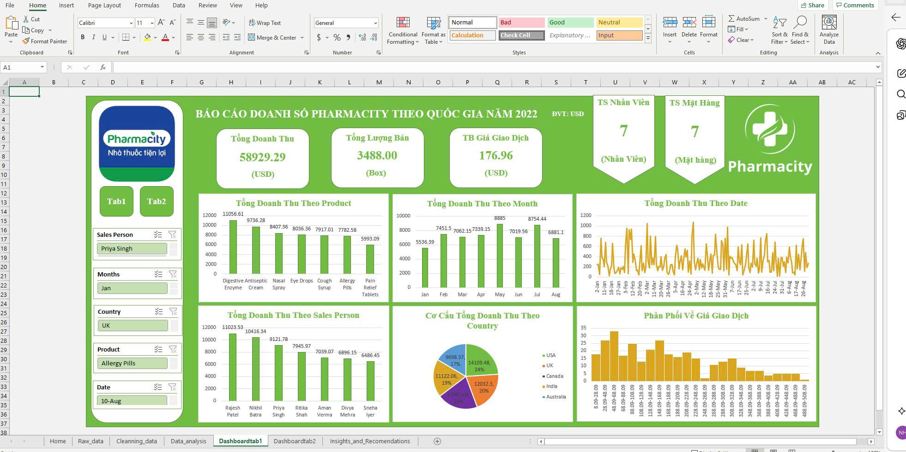
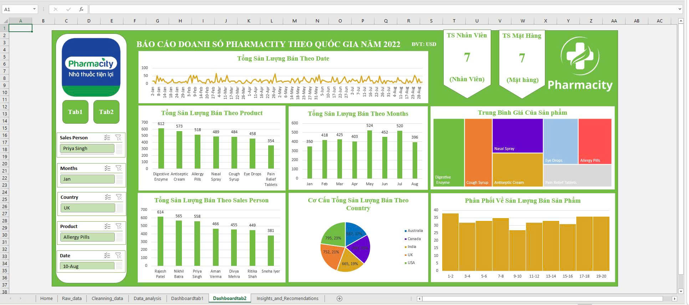

## Project Title: Phân tích dữ liệu doanh thu bán hàng của công ty dược phẩm Pharmacity năm 2022 theo quốc gia

Công cụ sử dụng: Microsoft Excel (Power Query, Pivot Table, Advanced Charts).

### 1. Mục tiêu dự án (Objective)

Phân tích dữ liệu doanh số bán hàng của công ty dược phẩm Pharmacity năm 2022, rút ra insight và đưa ra recomendations cho quyết định của công ty, nhằm cải thiện doanh số và tối ưu chi phí vận hành

Xây dựng dashboard tương tác động, giúp quản lý và theo dõi doanh số bán hàng của công ty Pharmacity theo quốc gia

### 2. Quy trình thực hiện (Workflow)

Data collection: Thu thập dữ liệu từ kaggle, tập dữ liệu về doanh thu bán hàng của công ty dược phẩm Pharmacity năm 2022

Data Cleaning: Xử lý dữ liệu khuyết (Missing values), xử lý dữ liệu trùng lặp (duplicate values), chuẩn hóa các kiểu dữ liệu sai

Data Analysis: Sử dụng Pivot Tables để trích xuất các chỉ số quan trọng như tổng doanh thu theo product, tổng doanh thu theo Sales Person, Tổng doanh thu theo Months, Tổng doanh thu theo Date. Tính toán các chỉ số KPIS như tổng doanh thu, tổng sản lượng bán và trung bình giá tiền trên 1 giao dịch.

Data Visualization: Thiết kế Dashboard tương tác với các Slicer giúp người dùng lọc dữ liệu theo quốc gia và danh mục sản phẩm, giúp quản lý có thể theo dõi doanh số bán hàng theo từng quốc gia

### 3. Các Insights quan trọng

Doanh thu tập trung 40% vào quý 4 do các chương trình khuyến mãi.

Danh mục hàng Điện tử có tỷ lệ hoàn trả cao nhất (15%), cần kiểm tra lại khâu vận chuyển.

### 4. Hình ảnh Dashboard

